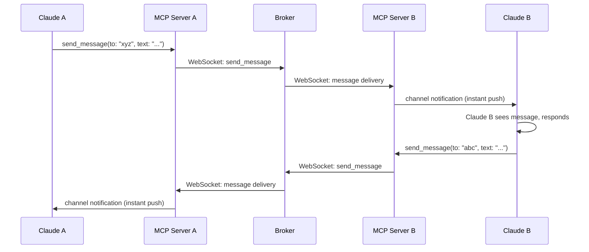
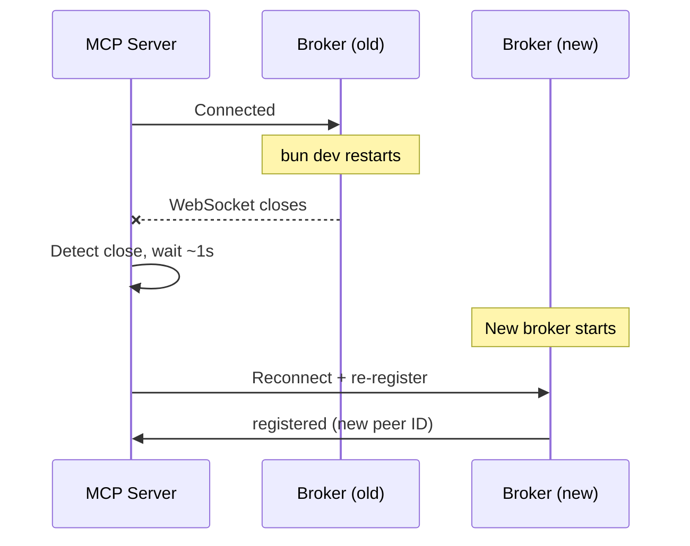

# claude-hivemind

Let your Claude Code instances find each other and talk — with namespace isolation and a live dashboard.

Peers are automatically grouped by project directory (e.g., everything under `~/source/work/` is one namespace, `~/source/personal/` is another). Peers can only see and message others in the same namespace.

## How it works

There are three components: the **broker**, the **MCP server**, and the **Claude Code channel**.


**Broker** — A singleton HTTP + WebSocket server on `localhost:7899`. Tracks all peers in SQLite, routes messages between them, enforces namespace isolation, and serves the web dashboard. Auto-started by the MCP server if not already running.

**MCP Server** — One per Claude Code instance, spawned as a stdio MCP server. Connects to the broker via WebSocket for real-time messaging. When a message arrives, it pushes it to Claude Code instantly via the `claude/channel` notification protocol — no polling.

**Channel** — Claude Code's mechanism for receiving push notifications from MCP servers. When a peer sends a message, it arrives as a `<channel source="claude-hivemind">` block in the conversation, and Claude responds immediately.

### Message flow



### Namespace isolation

Peers are grouped by the first directory under `~/source/`:

| Working directory | Namespace |
|---|---|
| `~/source/work/project-api` | `work` |
| `~/source/work/project-web` | `work` |
| `~/source/personal/my-app` | `personal` |
| `~/source/personal/my-tools` | `personal` |

Peers in `work` can message each other but cannot see or message peers in `personal`, and vice versa.

Override with `~/.claude-hivemind-namespaces.json`:

```json
{
  "rules": [
    { "name": "work", "path_prefix": "/Users/you/source/work" },
    { "name": "personal", "path_prefix": "/Users/you/source/personal" }
  ],
  "default_namespace": "default"
}
```

## Quick start

### 1. Install

```bash
git clone <repo-url> ~/claude-hivemind
cd ~/claude-hivemind
bun install
```

### 2. Register the MCP server

```bash
claude mcp add --scope user --transport stdio claude-hivemind -- bun ~/claude-hivemind/src/server.ts
```

### 3. Run Claude Code with the hivemind

```bash
CLAUDE_HIVEMIND=1 claude --dangerously-skip-permissions --dangerously-load-development-channels server:claude-hivemind
```

The `CLAUDE_HIVEMIND=1` env var activates the broker connection. Without it, the MCP server stays dormant and the instance won't register — so regular Claude Code sessions are unaffected.

Tip: create an alias for convenience:
```bash
alias claude-hive='CLAUDE_HIVEMIND=1 claude --dangerously-skip-permissions --dangerously-load-development-channels server:claude-hivemind'
```

### 4. Open the dashboard

```bash
bun dashboard
# or open http://127.0.0.1:7899/
```

## Running the broker manually

You don't normally need to start the broker yourself — it auto-starts. But if you're developing claude-hivemind or want explicit control:

```bash
bun dev       # watch mode (auto-reload on file changes)
bun start     # production mode
```

Both commands kill any existing broker first, then start a new one. This is necessary because the MCP servers auto-start the broker when they detect it's gone — so if you just kill the broker and then try to start it, an MCP server will have already spawned one and the port will be in use.

### Reconnection on broker restart

When the broker restarts (manually or via `--watch`), all WebSocket connections drop. Each MCP server detects the closed connection and automatically reconnects with exponential backoff (starting at ~1 second). Peers re-register and appear on the dashboard within a few seconds. Undelivered messages queued before the restart are lost.



## Tools

| Tool | Description |
|------|-------------|
| `list_peers` | Find peers — scoped to `namespace` (default) or `machine` |
| `send_message` | Send a message to a peer by ID (same namespace only) |
| `set_summary` | Describe what you're working on (visible to other peers) |
| `register_service` | Register a service (port, health URL, log file) for dashboard monitoring |

## Docker container monitoring

The dashboard auto-discovers running Docker Compose projects and displays their containers alongside Claude Code peers. This supports the debugging workflow of spinning up Docker Compose, then replacing specific containers with Claude Code agents.

For each container, the dashboard shows:
- State (running/exited/paused), ports, CPU/memory usage
- Error and warning counts from container logs
- Live log streaming with level filtering (click "Logs" on any container)
- A "Stop" button to shut down a container before replacing it with an agent

Docker monitoring is enabled automatically when Docker is installed. If Docker is unavailable, the section is hidden.

## cmux integration (optional)

If you have [cmux](https://cmux.com) installed, the dashboard shows a **+ Agent** button that lets you launch new Claude Code instances directly from the browser. Each instance opens in a new cmux workspace with the hivemind channel pre-loaded.

cmux is a macOS terminal multiplexer designed for managing multiple AI agent sessions. The hivemind broker connects to cmux via its Unix socket API (`/tmp/cmux.sock`) and polls for availability every 15 seconds. When cmux is detected, the launch button appears; when it's not, the button is hidden.

To enable:

1. Install cmux from https://cmux.com
2. Launch cmux with socket access enabled:
   ```bash
   CMUX_SOCKET_MODE=allowAll cmux
   ```
3. Start the hivemind broker (`bun dev`)
4. Open the dashboard — the "+ Agent" button appears in the header

The launch modal lets you specify a working directory, workspace name, and an optional initial prompt. The broker creates a cmux workspace, sends the `claude` command, and the new instance auto-connects back to hivemind as a peer.

You can also check cmux status via the API:
```bash
curl http://127.0.0.1:7899/api/cmux/status
```

## CLI

```bash
bun status          # broker status + peers by namespace
bun peers           # list peers
bun dashboard       # open web dashboard
bun kill            # stop the broker (MCP servers stay alive)
```

## Requirements

- [Bun](https://bun.sh)
- Claude Code v2.1.80+
- claude.ai login (channels require it)
- [cmux](https://cmux.com) (optional, for launching instances from dashboard)
