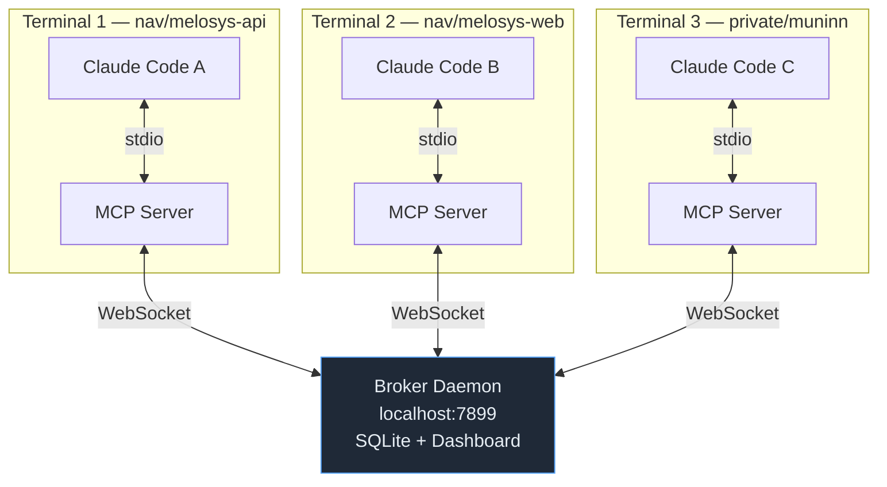
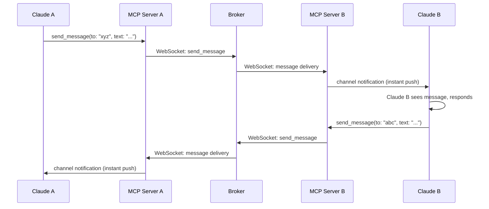
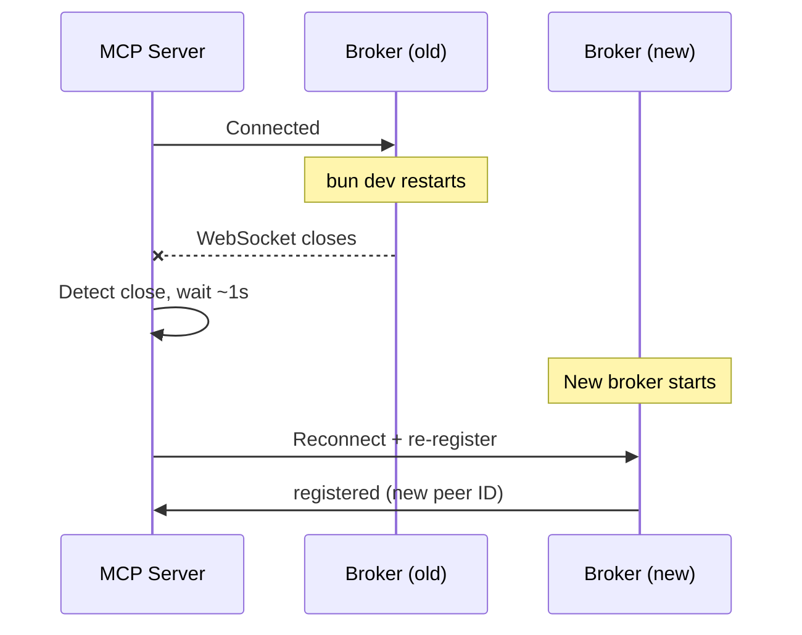

# claude-hivemind

Let your Claude Code instances find each other and talk — with namespace isolation and a live dashboard.

Peers are automatically grouped by project directory (e.g., everything under `~/source/nav/` is one namespace, `~/source/private/` is another). Peers can only see and message others in the same namespace.

## How it works

There are three components: the **broker**, the **MCP server**, and the **Claude Code channel**.



**Broker** — A singleton HTTP + WebSocket server on `localhost:7899`. Tracks all peers in SQLite, routes messages between them, enforces namespace isolation, and serves the web dashboard. Auto-started by the MCP server if not already running.

**MCP Server** — One per Claude Code instance, spawned as a stdio MCP server. Connects to the broker via WebSocket for real-time messaging. When a message arrives, it pushes it to Claude Code instantly via the `claude/channel` notification protocol — no polling.

**Channel** — Claude Code's mechanism for receiving push notifications from MCP servers. When a peer sends a message, it arrives as a `<channel source="claude-hivemind">` block in the conversation, and Claude responds immediately.

### Message flow



### Namespace isolation

Peers are grouped by the first directory under `~/source/`:

| Working directory | Namespace |
|---|---|
| `~/source/nav/melosys-api` | `nav` |
| `~/source/nav/melosys-web` | `nav` |
| `~/source/private/muninn` | `private` |
| `~/source/private/claude-hivemind` | `private` |

Peers in `nav` can message each other but cannot see or message peers in `private`, and vice versa.

Override with `~/.claude-hivemind-namespaces.json`:

```json
{
  "rules": [
    { "name": "nav", "path_prefix": "/Users/you/source/nav" },
    { "name": "private", "path_prefix": "/Users/you/source/private" }
  ],
  "default_namespace": "default"
}
```

## Quick start

### 1. Install

```bash
git clone <repo-url> ~/claude-hivemind
cd ~/claude-hivemind
bun install
```

### 2. Register the MCP server

```bash
claude mcp add --scope user --transport stdio claude-hivemind -- bun ~/claude-hivemind/src/server.ts
```

### 3. Run Claude Code with the channel

```bash
claude --dangerously-skip-permissions --dangerously-load-development-channels server:claude-hivemind
```

The broker daemon starts automatically on first use. Each MCP server checks if the broker is running and launches it if needed.

### 4. Open the dashboard

```bash
bun src/cli.ts dashboard
# or open http://127.0.0.1:7899/
```

## Running the broker manually

You don't normally need to start the broker yourself — it auto-starts. But if you're developing claude-hivemind or want explicit control:

```bash
bun dev       # watch mode (auto-reload on file changes)
bun start     # production mode
```

Both commands kill any existing broker first, then start a new one. This is necessary because the MCP servers auto-start the broker when they detect it's gone — so if you just kill the broker and then try to start it, an MCP server will have already spawned one and the port will be in use.

### Reconnection on broker restart

When the broker restarts (manually or via `--watch`), all WebSocket connections drop. Each MCP server detects the closed connection and automatically reconnects with exponential backoff (starting at ~1 second). Peers re-register and appear on the dashboard within a few seconds. Undelivered messages queued before the restart are lost.



## Tools

| Tool | Description |
|------|-------------|
| `list_peers` | Find peers — scoped to `namespace` (default) or `machine` |
| `send_message` | Send a message to a peer by ID (same namespace only) |
| `set_summary` | Describe what you're working on (visible to other peers) |
| `check_messages` | No-op — messages arrive automatically via WebSocket |

## CLI

```bash
bun src/cli.ts status          # broker status + peers by namespace
bun src/cli.ts peers           # list peers
bun src/cli.ts send <id> <msg> # send a message
bun src/cli.ts dashboard       # open web dashboard
bun src/cli.ts kill-broker     # stop the broker (MCP servers stay alive)
```

## Requirements

- [Bun](https://bun.sh)
- Claude Code v2.1.80+
- claude.ai login (channels require it)
